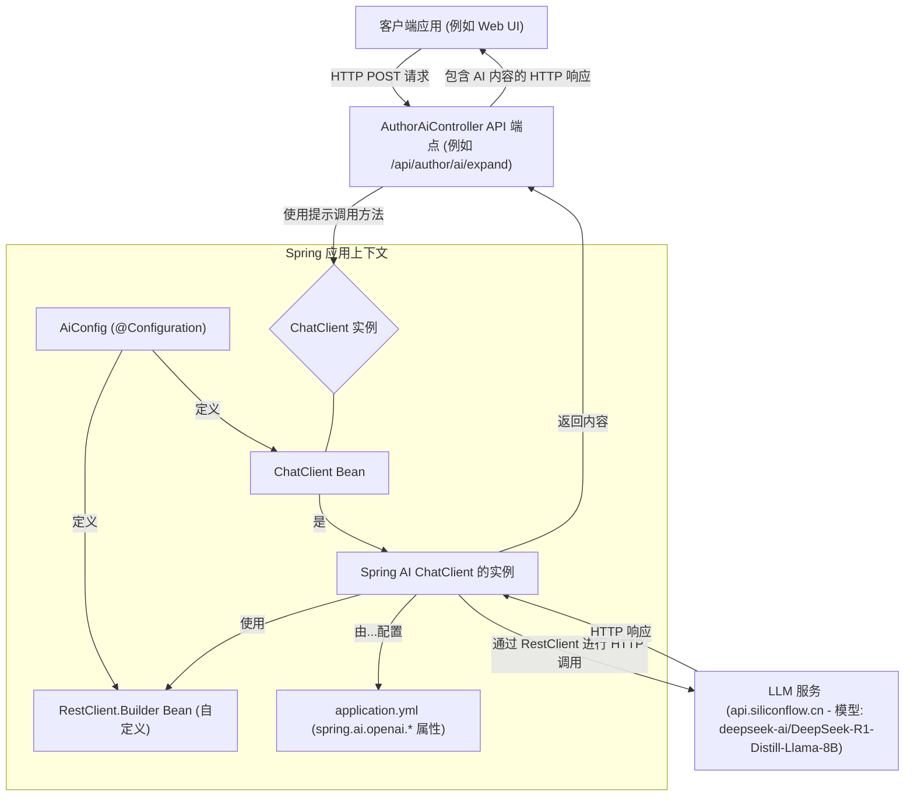

# Novel 项目 Spring AI 使用分析

本文档概述了“Novel”项目中 Spring AI 的使用情况，详细说明了其 AI 相关功能、执行流程、核心组件和调用关系。

## 1. 概述

该项目利用 Spring AI 集成大型语言模型（LLM）功能，专用于作者的文本处理任务。项目使用 `spring-ai-openai-spring-boot-starter` 连接与 OpenAI 兼容的 API，该 API 托管在 `https://api.siliconflow.cn`，并使用名为 `deepseek-ai/DeepSeek-R1-Distill-Llama-8B` 的模型。

项目中包含自定义配置，用于管理 Spring AI 使用的 HTTP 客户端（`RestClient`），以确保请求参数的正确序列化。

## 2. Spring AI 核心配置

### 2.1. 依赖项 (`pom.xml`)

-   **`spring-ai-openai-spring-boot-starter`**: 启用 Spring AI 对 OpenAI 的支持。
-   **`spring-ai-bom` (版本 `1.0.0-M6`)**: 管理 Spring AI 模块的版本，在 `<dependencyManagement>` 部分指定。

### 2.2. 应用配置 (`src/main/resources/application.yml`)

`spring.ai.openai`路径下的关键配置：

-   **`api-key`**: 用于访问 LLM 服务的 API 密钥（例如：`sk-rrrupturhdofbiqzjutduuiceecpvfqlnvmgcyiaipbdikoi`）。
-   **`base-url`**: LLM 服务端点：`https://api.siliconflow.cn`。
-   **`chat.options.model`**: 定义了使用的聊天模型：`deepseek-ai/DeepSeek-R1-Distill-Llama-8B`。

### 2.3. Java 配置 (`src/main/java/io/github/xxyopen/novel/core/config/AiConfig.java`)

-   **`AiConfig.java`**: 一个 Spring `@Configuration` 类，负责自定义 Spring AI相关的 Bean。
    -   **`restClientBuilder()` Bean**:
        -   为 Spring AI 的 `ChatClient` 提供自定义的 `RestClient.Builder`。
        -   如代码注释中所述，其主要目的是自定义 `RestClient`，以避免数字类型的请求参数（例如 AI 模型的 `temperature` 参数）因项目中全局 Jackson 设置 (`spring.jackson.generator.write-numbers-as-strings=true`) 而被错误地序列化为字符串的问题。
        -   设置 HTTP 客户端的连接超时时间（5000毫秒）和读取超时时间（60000毫秒）。
    -   **`chatClient()` Bean**:
        -   接收一个 `ChatClient.Builder`（由 Spring AI 根据 `application.yml` 中的属性自动配置），并构建 `ChatClient` 实例。
        -   这确保了整个应用程序中使用的 `ChatClient` 都能受益于自定义的 `RestClientBuilder`。

## 3. AI 功能

AI 功能通过 `AuthorAiController` (`src/main/java/io/github/xxyopen/novel/controller/author/AuthorAiController.java`) 对外提供，旨在帮助作者进行文本操作：

-   **文本扩写**:
    -   **端点**: `POST /api/author/ai/expand`
    -   **方法**: `AuthorAiController.expandText(String text, Double ratio)`
    -   **描述**: 输入一段文本和一个扩写比例，提示 LLM 将文本扩写到约为原文长度 `ratio/100` 倍。
    -   **提示示例**: `"请将以下文本扩写为原长度的" + ratio/100 + "倍：" + text`
-   **文本缩写**:
    -   **端点**: `POST /api/author/ai/condense`
    -   **方法**: `AuthorAiController.condenseText(String text, Integer ratio)`
    -   **描述**: 输入一段文本和一个缩写比例，提示 LLM 将文本缩写到约为原文长度的 `100/ratio`。
    -   **提示示例**: `"请将以下文本缩写为原长度的" + 100/ratio + "分之一：" + text`
-   **文本续写**:
    -   **端点**: `POST /api/author/ai/continue`
    -   **方法**: `AuthorAiController.continueText(String text, Integer length)`
    -   **描述**: 输入一段初始文本和期望的续写长度，提示 LLM 按指定的大致长度续写文本。
    -   **提示示例**: `"请续写以下文本，续写长度约为" + length + "字：" + text`
-   **文本润色**:
    -   **端点**: `POST /api/author/ai/polish`
    -   **方法**: `AuthorAiController.polishText(String text)`
    -   **描述**: 输入一段文本，提示 LLM 在保持原意的前提下，改进文本的质量、清晰度和风格。
    -   **提示示例**: `"请润色优化以下文本，保持原意：" + text`

## 4. 执行流程

AI 请求的通用执行流程如下：

1.  **HTTP 请求**: 客户端（例如 Web 应用中的作者界面）向 `AuthorAiController` 中定义的端点之一发送 HTTP POST 请求。
2.  **控制器处理**: `AuthorAiController` 中相应的方法（例如 `expandText`）被调用。它接收要处理的文本以及任何相关选项（例如比例、长度）等参数。
3.  **提示构建**: 控制器方法根据特定的 AI 任务和输入参数动态构建自然语言提示。
4.  **ChatClient 交互**:
    -   控制器使用注入的 `ChatClient` Bean（从 `AiConfig` 获取）。
    -   `chatClient.prompt().user(prompt)`: 创建一个包含已构建提示的用户消息。
    -   `.call()`: 此方法触发对 LLM 的实际 HTTP 请求。`ChatClient` 内部使用配置的 `RestClient`（来自 `AiConfig`）和 OpenAI 设置（来自 `application.yml`），将请求发送到 `base-url` (`https://api.siliconflow.cn`)，目标是指定的 `model` (`deepseek-ai/DeepSeek-R1-Distill-Llama-8B`)。
    -   `.content()`: LLM 处理提示并返回响应后，此方法从该响应中提取文本内容。
5.  **响应生成**: AI 生成的文本被包装在 `RestResp<String>` 对象中（项目中通用的响应包装器），并作为 HTTP 响应返回给客户端。

## 5. 使用的关键 Spring AI 组件

-   **`ChatClient`**: Spring AI 提供的核心接口，用于与基于聊天的 LLM 进行交互。它提供了一个流畅的 API 来构建提示和进行调用。
-   **`ChatClient.Builder`**: 由 Spring Boot 和 Spring AI 自动配置，此构建器在 `AiConfig` 中用于构建 `ChatClient` Bean。它整合了来自 `application.yml` 的设置。
-   **提示工程 (Prompting)**: 尽管在 `AuthorAiController` 中没有显式使用外部模板文件或复杂的 `PromptTemplate` 对象，但提示是直接在控制器方法内部作为字符串构建的。然后 `ChatClient` 将这些字符串作为用户输入。

## 6. 调用关系

**关系说明:**

1.  **客户端应用** 向 `AuthorAiController` 中的一个端点发出 HTTP 请求。
2.  `AuthorAiController` 接收请求，构建提示，并使用注入的 `ChatClient`（即 `CCBean` 实例）。
3.  `ChatClient` Bean (`CCBean`) 由 `AiConfig` 创建。`AiConfig` 还定义了一个自定义的 `RestClient.Builder` (`RCBuilder`) 来处理潜在的 Jackson 序列化问题并设置超时。
4.  `ChatClient` 使用 `application.yml` 中的属性（API 密钥、基础 URL、模型名称）进行配置，这些属性由 Spring AI 的自动配置功能自动获取，并用于 `ChatClient.Builder`。
5.  `ChatClient` 使用 `RestClient`（由 `RCBuilder` 构建）对外部 **LLM 服务** 进行 HTTP 调用。
6.  LLM 服务处理请求并返回响应。
7.  `ChatClient` 从 LLM 的响应中提取内容并将其返回给 `AuthorAiController`。
8.  `AuthorAiController` 将 AI 生成的内容作为 HTTP 响应发送回客户端应用。

这种架构有效地解耦了 AI 交互逻辑，使其在 Spring 生态系统内易于配置和管理。
